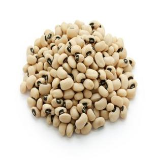
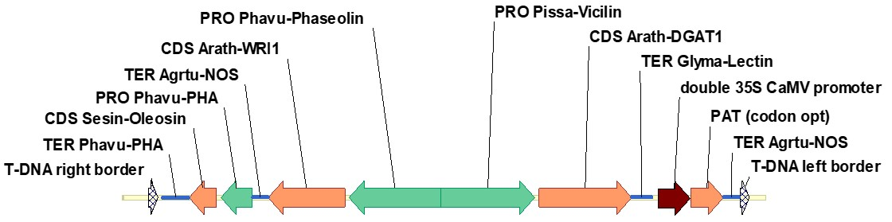
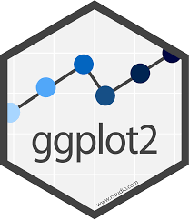

```{r setup, include=FALSE}
knitr::opts_chunk$set(
  results = 'asis',
  echo = FALSE,
  warning = FALSE,
  message = FALSE,
  fig.align = 'center'
)

###Load libraries
library(tidyverse)
library(kableExtra)
library(png)
library(ggplot2)
library(grid)

###reading files
read_csv('data/embryo_all_normalised.csv')
embryo_expression <- read_csv('data/embryo_all_normalised.csv')

read_csv('data/cowpea_geneatlas.csv')
gene_atlas <- read_csv('data/cowpea_geneatlas.csv')

read_csv('data/sample_oilcontent.csv')
oilcontent <- read_csv('data/sample_oilcontent.csv')


###merging gene files
gene_atlas <- gene_atlas <- rename(gene_atlas, Id=1)
colnames(gene_atlas)
gene_annotation <- select(gene_atlas, 1,2, 25)
view(full_join(embryo_expression, gene_annotation, by = c('Id')))
embryo_expression_annotation <- full_join(embryo_expression, gene_annotation, by = c('Id'))
embryo_expression_annotation <- rename(embryo_expression_annotation, annotation=11, gene_name=10)

####tidying expression table
tidy_embryo_expression <- embryo_expression_annotation %>% 
  gather(key = Sample_name, value = ammount, -Id, -annotation, -gene_name)
tidy_embryo_expression <- tidy_embryo_expression %>% 
  mutate(sample = Sample_name)
tidy_embryo_expression <- separate(tidy_embryo_expression, Sample_name, into = c('sample_name', 'tissue', 'stage'), sep = "_")
tidy_embryo_expression <- separate(tidy_embryo_expression, sample_name, into = c('todelete', 'genotype'), sep = "m.")
tidy_embryo_expression <- rename(tidy_embryo_expression, gene_id=1, expression=8)
tidy_embryo_expression <- tidy_embryo_expression %>% select(-todelete)

write_csv(tidy_embryo_expression, 'results/tidy_embryo_expression.csv')

```


# Introduction
My name is **Jose Barrero** and I am a Research Scientist in Agriculture and Food. I recently started leading the Cowpea Team in Black Mountain. I have not done any coding before but I generate large datasets that need complex analysis, so that is why I decided to learn a bit of R and to come to Data School as part of my _Julius Career Award_ activities.

# My Project
My project is about exploring gene changes in a **transgenic "high-oil" cowpea** line that we have made. Cowpea (Image 1) is a key staple crop in West Africa being a main protein source for over 200 million people. By introducing the gene cassette that appears below (Image 2) with three oil-related genes (oleosin, WRI1 and DGAT1) we tried to increased the oil-content in the seeds making them more nutritious.

Our transgenic line (**named 15B**) has about 7 times more oil in the seeds that the wildtype line (**named IT86**). We collected RNA samples from developing seeds from 15B and IT86 at **4 different stages** and performed a trancriptomic RNAseq analysis. 

The goal of this project is to evaluate the gene expression changes bewteen the two genotypes and to identify genes related with the production of oil. The plan was making a heatmap illustrating the gene expression changes across the samples and to group the genes into clusters with similar expression patterns.


{width=250px}{width=650px}


## Description of the samples
After generating the transgenic line, we first analysed the oil content in wildtype (**IT86**) and transgenic (**15B**) seeds during seed developmet (Figure 1). The transgenic line showed a significant increased in oil content from stage 3, remaining high until stage 5 (matured dry seed). 
So we decided to collect RNA samples from stages 1 to 4 to performed RNAseq. 

```{r standard-plot1, echo=FALSE, out.width='60%', fig.align='center', fig.height= 4, fig.width=6, fig.cap="Oil content analysis in our cowpea samples. Seeds from five developmental stages were analysed, being the stage 5 the dry mature seed. For gene expression analysis RNA samples were collected from stages 1 to 4."}

img <- readPNG("data/oildrop.png")

Oilcontent_plot <- ggplot(data = oilcontent,
  mapping = aes(x = stage, y = oil_contentDW, colour = genotype, size = weight_mg)
) + annotation_custom(rasterGrob(img, 
                               width = unit(1,"npc"),
                               height = unit(1,"npc")), 
                    -Inf, Inf, -Inf, Inf) + geom_point() 

Oilcontent_plot <- Oilcontent_plot +  
  labs(x = "Seed developmental stage",
       y = "Oil content (% DW)",
       size = "Seed weight (mg)",
       colour = "Genotype") + 
  scale_y_continuous(limits=c(0, 10))+
  
  theme(
    panel.grid.minor = element_blank(),
    plot.title = element_text(face = "bold"),
    strip.background = element_blank(),
    panel.grid.major = element_line(size = 1),
    axis.title = element_text(size = 10, face = "bold"),
    )

Oilcontent_plot
```

## Workflow
I started with a matrix of expression values and first I have to transform the data into a tidy dataframe and merge different files to add the gene descriptions into it. After that I did some basic data processing to remove genes with low expression, transform the expression and normalise it.

After that I performed a cluster analysis using k-means clustering (`cluster::clara()`) with an arbitrary number of clusters (for this example I used k=10) to get a quick look at expression patterns. It was a bit tricky because for this kind of analysis I have to change between dataframes and matrices, but I got there at the end (Table 1).


```{r mytable, out.width='80%', echo = FALSE}

expn_data <- read_csv("results/tidy_embryo_expression.csv")

# Basic Data processing: 
  # 1: Remove genes with 0 expression
  # 2: Convert to log scale
  # 3: Normalise each gene to mean=0, sd=1

expn_scaled <- expn_data %>% 
	group_by(gene_name) %>% 
	filter(sum(expression) > 100) %>% 
	mutate(
		log_expn = log2(expression + 1),
		norm_expn = (log_expn - mean(log_expn))/sd(log_expn)
	) %>% 
	ungroup()

# Clustering needs expression in matrix format.
  # The final step converts it from a tibble into a data.frame with
  # the gene names as the 'rownames' of the data.frame
  # This removes the gene names from the data (with only numeric data) 
  # and makes them more metadata for each row

expn_table <- expn_scaled %>%
	select(gene_name, norm_expn, sample) %>% 
	spread(key = sample, value = norm_expn) %>% 
	column_to_rownames("gene_name") 
	
#For this sort of preliminary data, recommendation of k-means
# clustering with an arbitrary choice of the number of clusters (k)

expn_clustered <- cluster::clara(expn_table, k = 10)

# The cluster result (expn_clustered) has an element called clustering that 
# shows what cluster each gene is assigned to. We can access this with expn_clustered$clustering
# We sort this so that the genes from each cluster are together, then get 
# the gene names with names() -- the rownames from the expn_table data.frame
# are used to give names to the clustering output.

gene_order <- names(sort(expn_clustered$clustering))

#getting cluster numbers
cluster_info <- tibble(cluster = expn_clustered$clustering, gene_name = names(expn_clustered$clustering))
view(full_join(expn_scaled, cluster_info, by = c('gene_name')))
tidy_expression_cluster <- full_join(expn_scaled, cluster_info, by = c('gene_name'))
tidy_expression_cluster <- tidy_expression_cluster %>% select(-gene_id)


knitr::kable(head(tidy_expression_cluster, n = 5), format = "html", caption = "First rows of the final table containing the clustered relative expression values for each gene and their annotations.") %>% 
  kable_styling("striped")
```

## Results
### Whole genome clustering
Once I obtained the data frame containing the clustered genes with relative expression values I used `ggplot()` to built the heatmap converting the gene names to a factor, with the levels of the factor being the gene order produced by the clustering (Figure 2).

```{r standard-plot2, echo = FALSE, out.width='60%', fig.align='center', fig.height= 8, fig.width=6, fig.cap="Gene expression heatmap during seed developmet. Normalised expression of 24,534 genes is shown for all transgenic (T) and wildtype (WT) samples."}


# Make plot by coverting first the gene names to a factor, 
#with the levels of the factor being our gene order.

heatmap_plot <- tidy_expression_cluster %>% 
	mutate(gene_name = factor(gene_name, levels = gene_order)) %>% 
	ggplot(aes(y = gene_name, x = sample, fill = norm_expn)) +
	geom_tile() +
  facet_grid(~ genotype, switch = "x", scales = "free_x", space = "free_x") +
	scale_y_discrete(labels = NULL, breaks = NULL) +
	scale_fill_distiller(palette = "RdBu") +
  scale_x_discrete(labels=c("norm.T_Embryo_1"="1", "norm.T_Embryo_2"="2","norm.T_Embryo_3"="3", "norm.T_Embryo_4"="4",
                            "norm.WT_Embryo_1"="1","norm.WT_Embryo_2"="2","norm.WT_Embryo_3"="3", "norm.WT_Embryo_4"="4"))

heatmap_plot <- heatmap_plot +  
  labs(x = "Seed developmental stage",
       y = "Genes",
       fill = "Normalized expression") +
  theme(
    plot.title = element_text(face = "bold"),
    axis.title = element_text(size = 10, face = "bold"),
    legend.position="bottom")

heatmap_plot
```

# My Digital Toolbox
For this project I have used mainly the `Tydyverse` package, but I had to add a few others to add images to graphs (`library(png)` and `library(grid)`) I also explored the `heatmap()` function that is built in R for using a matrix of data, although I decided to use `ggplot` at the end for making the heatmap.

## Favourite tools
{width=100px}{width=90px} and of course {width=90px}

# My time went ...
I spent about 10% of the time tidying the data, about 80% trying to do the cluster analysis and heatmap, and about 10% preparing the Rmarkdown file. I found it a bit overwhelming initially because there where so many options when I searched the web for help. It was difficult to change from dataframes to matrix formats. Also, because I tried to analyse the whole cowpea genome I was running out of computing power. Likely, the instructors put me into the right track and I could find the appropiate approach.

# Next steps
After this exploratory work, I need now to keep playing with the pre-processing filtering steps and with the clustering parameters to filter the genes to identify those more likely to be biologically relevant for oil accumulation.

# My Data School Experience
With this exercise I was able to identify groups of genes that are high- or low-expressed at different stages during seed developemnt in transgenic seeds with high oil.

I am very happy to have attended **Data School**. The experiencxe has been much more positive than I though and, starting from zero, I have learnt heaps. The course was very well structured and the teachers were fantastic. I will definetly recommend it.

**Thanks a lot to Spephen, Keransa, Khristian and all the helpers for your effort and patience!**

And thanks to TJ Higgins, Surinder Singh and Jerome Verdier for sharing the data.

R version: `r getRversion()`
Tidyverse version: `r packageVersion("tidyverse")` 